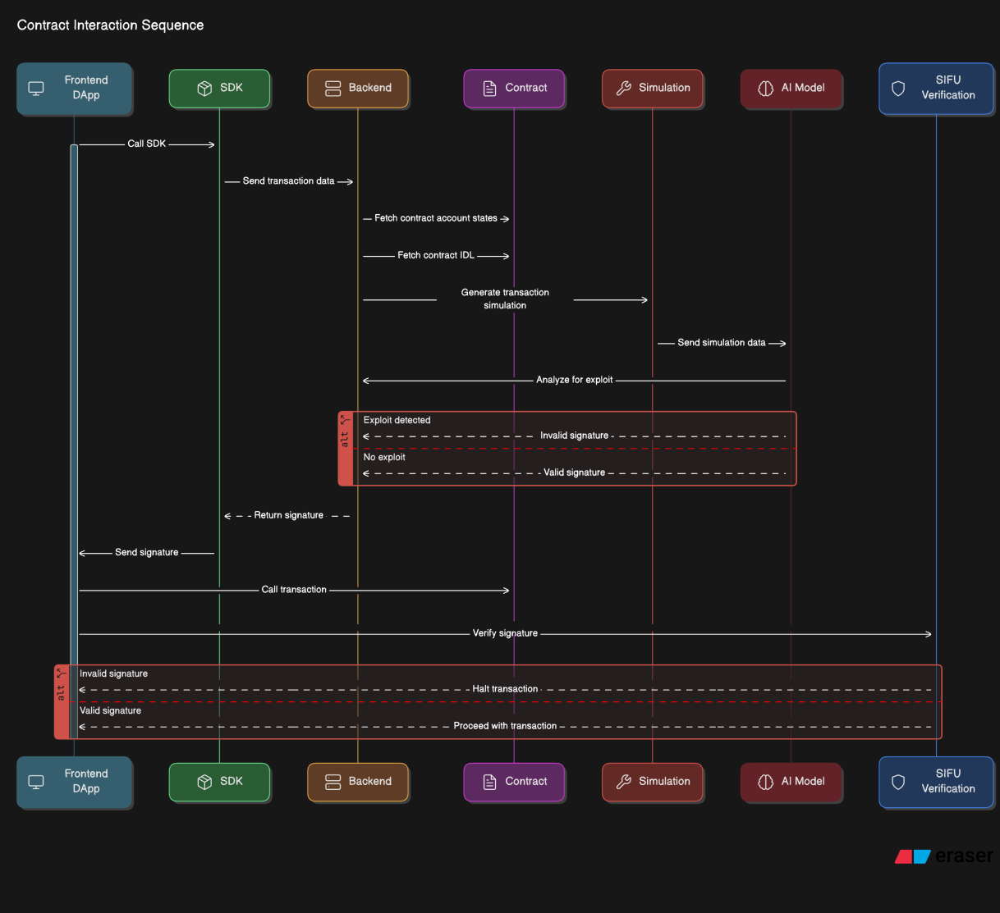
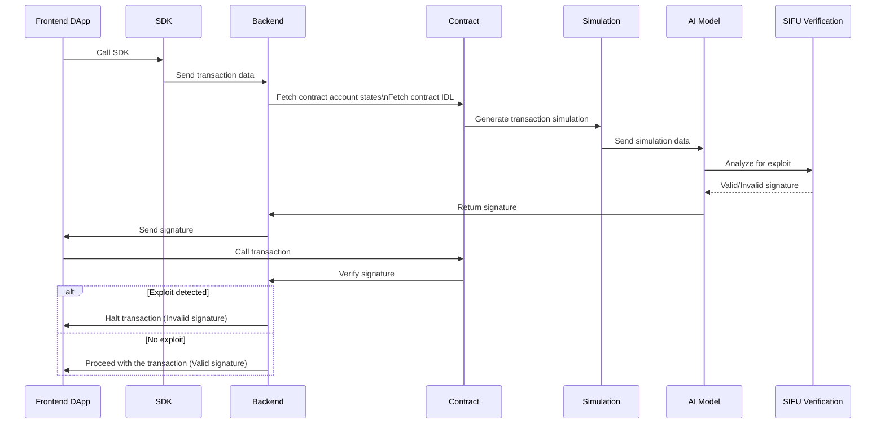
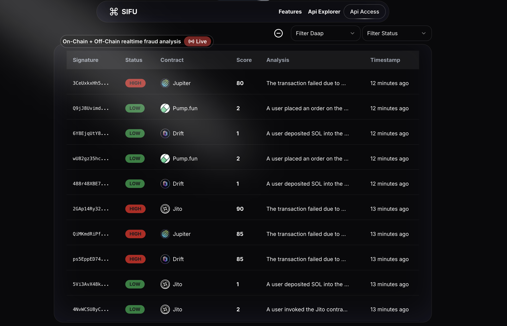
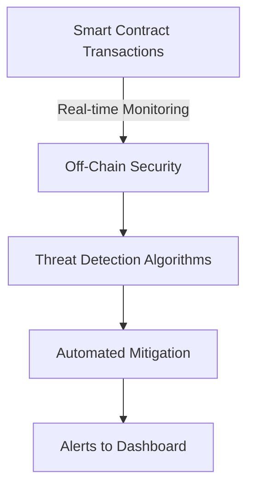

# Sifu Security 🔒
### Protecting Smart Contracts with On-Chain and Off-Chain Security Solutions

[](https://sifusecurity.com)

---

## 📜 **Overview**

Sifu Security offers a comprehensive solution to protect decentralized applications (DApps), DeFi platforms, NFT marketplaces, and cross-chain protocols from smart contract vulnerabilities and exploits. As the blockchain ecosystem continues to grow, securing smart contracts in real-time has become more critical than ever.

Our system integrates **on-chain** monitoring for real-time threat detection and **off-chain** auditing to ensure your contracts are secure, continuously compliant, and future-proofed against evolving risks.

---

## 🚀 **Why Sifu Security?**

- **Real-time protection**: Automatically detect and mitigate security threats as they happen on-chain.
- **Comprehensive audits**: Deep, off-chain smart contract audits to identify vulnerabilities before they are exploited.
- **Seamless integration**: Works with existing Solana, Ethereum, and Binance Smart Chain-based DApps without disrupting operations.
- **Scalability**: Designed to protect projects of all sizes, from small NFT platforms to large-scale DeFi protocols.

---

## 🎯 **Key Features**

1. **On-Chain Protection**: 
    - Real-time monitoring of smart contract transactions.
    - Automated threat detection and mitigation.
    - Machine learning algorithms to flag suspicious behavior.
   
2. **Off-Chain Monitoring**:
    - Off-chain, our system continuously monitors the transaction ecosystem for unusual patterns or signs of fraud.
    - Any suspicious activities are flagged by our AI-driven threat detection algorithms.
    - DApp owners will receive instant alerts when suspicious activity is detected, allowing them to take action before a threat becomes reality.
    - This provides an additional layer of security, even outside of the blockchain.
    - Alerts and insights are sent to your user dashboard for full visibility.
     
3. **User-Friendly Dashboard**:
    - A centralized interface to monitor contract security.
    - Real-time alerts and reports to keep your project safe and informed.

---

## 🛠️ **How It Works**

Sifu Security works in a dual-layer approach:

### **1. On-Chain Protection Flow**






1. Smart contract transactions are integrated with our SDK and our Verification Contract.
2. SDK detects any malicious transactions and returns and invalid signature.
3. Transactions are halted on chain because of invalid signature due to AI detecting it's an exploit.

---

### **2. Off-Chain Monitoring Flow**






1. Off-chain, our system continuously monitors the transaction ecosystem for unusual patterns or signs of fraud.
2. Any suspicious activities are flagged by our AI-driven threat detection algorithms.
3. DApp owners will receive instant alerts when suspicious activity is detected, allowing them to take action before a threat becomes reality.
4. This provides an additional layer of security, even outside of the blockchain.
5. Alerts and insights are sent to your user dashboard for full visibility.

---

## 📈 **Usage**

To integrate Sifu Security into your project, follow the steps below:

### **Step 1: Install the Sifu Security Package**

```bash
npm install sifu-security
```

### **Step 2: Set Up On-Chain Monitoring**

Add the following snippet to your Solana contract to begin real-time monitoring:

```js
const SifuSecurity = require('sifu-security');

// Initialize monitoring
SifuSecurity.startMonitoring(contractAddress);
```

### **Step 3: Submit Contracts for Audit**

Submit your smart contracts for an off-chain audit:

```bash
sifu-security audit <contract_file.sol>
```

### **Step 4: Monitor via the Dashboard**

Visit [Sifu Security Dashboard](https://dashboard.sifusecurity.com) to access your project’s real-time security status and audit results.

---

## 🎯 **Target Audience**

Sifu Security is perfect for:

- **DeFi Platforms**: Protect your users' assets with real-time security and threat mitigation.
- **NFT Marketplaces**: Ensure safe and secure trading of digital assets.
- **Cross-Chain Bridges**: Safeguard the integrity of multi-chain transactions.
- **Enterprise Blockchain Projects**: Continuous compliance and security management for complex systems.

---

## 🛠️ **Tech Stack**

- **Languages**: Rust, Python, JavaScript
- **Blockchain**: Solana

---

## 🌍 **Roadmap**

1. **Q4 2024**:
   - Release beta version of Sifu Security's on-chain and off-chain smart contract protection platform.
   - Launch SDK to users and on chain integration tools.
3. **Q1 2025**:
   - Begin onboarding early adopters from the Solana ecosystem for real-world testing.
   - Establish partnerships with key DeFi, NFT, and cross-chain bridge projects on Solana.
   - Complete third-party security audits to verify product efficacy.
4. **Q2 2025**:
    - Launch the full version of Sifu Security, including advanced real-time monitoring, automated threat response, and enterprise-grade dashboards.
    - Expand product offerings to other blockchains such as Ethereum and Binance Smart Chain
6. **Q3 2025**:
   - Develop specialized solutions for enterprises needing customized security features and regulatory compliance tools.
   - Partner with legal and regulatory bodies to ensure compliance with evolving blockchain regulations.
---


## 📞 **Support**

For support, feel free to reach out to us via:

- **Website**: [Sifu Security](https://sifusecurity.com)

---

## 📜 **License**

All Rights Reserved

© [2024] [SIFU SECURITY]. All rights reserved.

This software and associated documentation files (the "Software") are the proprietary property of [SIFU SECURITY] and are protected by copyright law and international treaties.

You may not:

- Use the Software for any purpose, including but not limited to personal, educational, or commercial use.
- Distribute, copy, modify, or reverse engineer the Software.
- Incorporate the Software into other software or products without explicit written permission from [SIFU SECURITY].

Unauthorized use of this Software may result in legal action.
